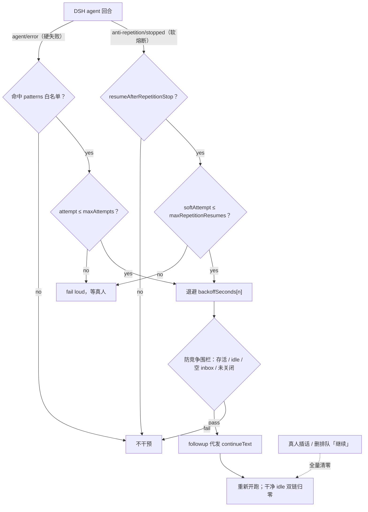

# dsh-auto-continue

[](https://github.com/shu0819-sjy/dsh-auto-continue/actions/workflows/ci.yml)
[](./LICENSE)
[](https://nodejs.org/)
[](./CHANGELOG.md)

DSH 轮次失败 / 复读熔断后自动续跑套件。包含 **auto-continue v1.3**（失败与软熔断后代发「继续」）与 **anti-repetition v2**（流式复读/断流熔断并广播事件）。MIT 许可。

## 特性

- **双链架构**：硬失败链（超时/网络/5xx 白名单）与软熔断链（anti-repetition 事件）独立计数、共用退避与防竞争围栏
- **错误白名单**：仅匹配超时、网络、overload、429/5xx 等可恢复错误才续跑
- **退避与上限**：默认 5s → 15s → 30s；硬失败 ≤3 次、软熔断 ≤2 次，到顶 fail loud
- **防竞争围栏**：发送前复查 agent 仍存活、仍 idle、inbox 无排队、运行时未关闭（同 dsh-goal-round-driver）
- **真人否决**：inbox 出现真人消息，或用户删除排队中的 auto-continue「继续」，立即清零计数并撤定时器
- **子 agent 保护**：默认跳过 `origin === "subagent"`，避免与父级重试双跑
- **测试**：25 Mock + 5 集成 + 11 静态，共 41 项

## 工作原理

### 插件机制（挂载 / 事件总线 / 双链熔断）

1. **挂载**：`install/*.ps1|sh`（或手动）把 `plugins/*.mjs` 复制进
   `<DSH_HOME>/profiles/web/plugins/`，并在 `cordis.patch.yml` 幂等插入
   `id: anti-repetition` 与 `id: auto-continue` 两段。Cordis 按 patch 加载 ESM
   插件；`auto-continue` `inject: ["agents"]`，在 agent 生命周期上挂监听。
2. **事件总线**：
   - 硬失败链订阅回合失败（如 `agent/error`），用 `patterns` 白名单过滤可恢复错误；
   - 软熔断链订阅 `anti-repetition/stopped`（由 anti-repetition 在流式复读/断流
     熔断时广播）；
   - 续跑通过 agents 服务 `followup` 代发 `continueText`，不直连上游 HTTP。
3. **双链熔断**：硬失败计数 `attempt`（默认 ≤3）与软熔断计数 `softAttempt`
   （默认 ≤2）独立；共用退避表与防竞争围栏（存活 / idle / 空 inbox / 运行时未关）。
   真人 inbox 消息或删除排队中的「继续」视为否决并全量清零；任一条链到顶时同时
   重置两条计数器。子 agent（`origin === "subagent"`）默认跳过。



**护栏清单**

1. 错误白名单（硬失败链）
2. 退避表 + 连发上限（两链独立）
3. 防竞争围栏（存活 / idle / 空 inbox / 运行时未关）
4. 真人消息重置
5. UI 删除排队「继续」视为否决（v1.3）
6. 子 agent 默认跳过
7. 干净 idle 双链归零；任一条链到顶时同时重置两条计数器（v1.3）

## 安装

安装会把 `plugins/*.mjs` 复制到 `<DataDir>/profiles/web/plugins/`，并在 `cordis.patch.yml` 幂等追加挂载段。**改完后必须重启 DSH（托盘退出才算真重启）**。

### 方式一：安装脚本

**Windows（PowerShell）**

```powershell
pwsh -File install/install.ps1
# 或显式指定数据目录：
pwsh -File install/install.ps1 -DataDir "$env:DSH_HOME"
```

**探测顺序**（未传 `-DataDir` 时）：环境变量 `DSH_HOME` → `%APPDATA%\dsh-desktop\data`。

**行为要点**

- 复制仓库 `plugins/` 下全部 `.mjs`，并做 SHA256 校验
- 若不存在 `cordis.patch.yml` 则创建并写入挂载段；若已含 `id: auto-continue` 则跳过追加（幂等）
- 结束后提示重启 DSH，并建议跑 `node test/check.mjs`（11/11）做静态自检

**macOS / Linux**

```bash
bash install/install.sh
# 或显式指定数据目录（位置参数）：
bash install/install.sh "$HOME/.dsh/data"
```

**探测顺序**（未传参数时）：环境变量 `DSH_HOME` → `~/.dsh/data`。行为与 Windows 脚本一致（复制校验、幂等追加 patch、需重启）。

### 方式二：手动安装

1. 将 `plugins/auto-continue.mjs` 与 `plugins/anti-repetition.mjs` 复制到 `<DSH_HOME>/profiles/web/plugins/`
2. 把 [`examples/cordis-patch.snippet.yml`](examples/cordis-patch.snippet.yml) 的内容追加到 `<DSH_HOME>/profiles/web/cordis.patch.yml` 末尾
3. （可选）把 [`examples/settings-retry.snippet.yml`](examples/settings-retry.snippet.yml) 合并进 `settings.yaml` 的对应 provider，拉长上游超时与重试
4. 重启 DSH

### 卸载

从 `cordis.patch.yml` 删除 `id: anti-repetition` 与 `id: auto-continue` 两段 insert，并删除对应 `plugins/*.mjs`，然后重启 DSH。

## 配置参考

以下键与默认值均从 `plugins/*.mjs` 的 `Config` 导出逐键核实。挂载样例见 `examples/cordis-patch.snippet.yml`。

### auto-continue v1.3

| 键 | 默认值 | 说明 |
| --- | --- | --- |
| `enabled` | `true` | 总开关 |
| `continueText` | `"继续"` | 自动续跑时代发的文本 |
| `maxAttempts` | `3` | 硬失败连发上限（1–10） |
| `maxRepetitionResumes` | `2` | 软熔断连发上限（1–10） |
| `resumeAfterRepetitionStop` | `true` | 是否在 anti-repetition 熔断后自动续跑 |
| `backoffSeconds` | `[5, 15, 30]` | 退避表（秒）；第 n 次取 `min(n-1, len-1)` |
| `patterns` | 见下 | 可续跑错误白名单（不区分大小写的正则） |
| `includeSubagents` | `false` | 子 agent 失败是否也续跑 |

默认 `patterns`：`timed out`、`timeout`、`etimedout`、`econnreset`、`econnrefused`、`econnaborted`、`epipe`、`socket hang up`、`fetch failed`、`network`、`overloaded`、`rate limit`、`\b(?:429|500|502|503|504|529)\b`。

### anti-repetition v2

| 键 | 默认值 | 说明 |
| --- | --- | --- |
| `models` | `["*"]` | 流式复读检测作用的模型 id 通配；空数组 = 全部 |
| `samplingModels` | `["*glm-5.3-flash*", "*glm*flash*"]` | 仅对这些模型注入 frequency/presence penalty |
| `minRepeats` | `3` | 连续重复次数阈值（含当前段） |
| `minUnitLen` | `5` | 重复单元最短字符数 |
| `maxUnitLen` | `96` | 重复单元最长字符数 |
| `checkEveryChars` | `12` | 每累计多少新字符再检测一次 |
| `windowChars` | `1600` | 检测窗口（只看末尾这么多字符） |
| `minLineRepeats` | `3` | 同一行连续重复阈值 |
| `enableDensity` | `false` | 密度检测（默认关，避免技术长文误伤） |
| `minDensityHits` | `8` | 密度命中次数阈值 |
| `densityMinLen` | `20` | 密度候选最短长度 |
| `enableNormStem` | `true` | 归一化短词干刷屏检测 |
| `minStemHits` | `12` | 词干命中次数阈值 |
| `minStemShare` | `0.35` | 词干占比阈值 |
| `minStemLen` | `3` | 词干最短长度 |
| `maxStemLen` | `24` | 词干最长长度 |
| `enableCollapseDetect` | `true` | 早期崩溃：一字一行 / 破损 shell 草稿 |
| `minSingleCharLines` | `40` | 单字符行数阈值 |
| `minSingleCharShare` | `0.3` | 单字符行占比阈值 |
| `minBrokenShellHits` | `8` | 破损 shell 草稿命中阈值 |
| `enableUniqueRatio` | `false` | 低多样性检测（默认关） |
| `minUniqueRatio` | `0.12` | 唯一字符占比下限 |
| `uniqueMinChars` | `200` | 启用唯一比检测的最小字符数 |
| `appendNotice` | `true` | 命中后是否追加可见提示 |
| `noticeText` | 见源码默认 | 追加提示文案 |
| `watchReasoning` | `true` | 是否也监控思考链 |
| `injectSamplingParams` | `true` | fetch 兜底注入 sampling penalty |
| `frequencyPenalty` | `0.55` | frequency_penalty |
| `presencePenalty` | `0.4` | presence_penalty |

## 实战验收

重启 DSH 后，在聊天中发送：

```text
请连续输出300个x
```

**预期时序（软熔断链）**

1. 模型开始刷屏 `x` / 短句复读
2. `anti-repetition` 命中 → 流停止，追加 notice（若 `appendNotice`）→ 广播 `anti-repetition/stopped`
3. agent 进入 idle 后，`auto-continue` 按退避表等待（默认首次 5s）
4. 防竞争复查通过 → 代发来源为 auto-continue 的「继续」（`continueText`）
5. 若再次熔断，软链最多再续到 `maxRepetitionResumes`（默认 2）；到顶写 warn 并放弃，等真人介入

硬失败链同理：上游超时/网络错误命中 `patterns` → idle → 退避 → 代发「继续」，上限 `maxAttempts`（默认 3）。

## 测试

### CI（可移植，无需 DSH）

GitHub Actions 跑 `node test/ci-static.mjs`（Node 18/20/22）：语法检查 + 源码/示例契约断言，**不** import 插件（插件依赖仅存在于 DSH 安装内的 `@deepseek-ai/*`）。

```bash
node test/ci-static.mjs
```

### 本机全量（需 DSH / `@deepseek-ai/*`）

在仓库根目录（通常设置 `DSH_HOME`，或依赖 `test/_dsh-env.mjs` 探测本机安装）：

```bash
node test/test.mjs          # 25/25 Mock（需 DSH node_modules）
node test/integration.mjs   # 5/5 集成（需 @deepseek-ai/cordis）
node test/check.mjs         # 11/11 静态自检（需已安装的 plugins + cordis.patch.yml）
```

## FAQ

**为什么有上限、不会死循环？**  
硬失败与软熔断各自有连发上限（默认 3 / 2），到顶 fail loud 并写 warn；真人消息或删除排队「继续」会立即清零。干净成功的 idle 也会归零。

**错误白名单是什么？**  
`patterns` 是一组不区分大小写的正则，匹配错误链全文。默认只覆盖超时、连接重置、network、overloaded、rate limit、429/5xx 等可恢复错误。鉴权失败、内容审查等不在名单内，不会自动续跑。

**子 agent 为何默认跳过？**  
`includeSubagents: false` 时跳过 `session.header.origin === "subagent"`，避免父级与子级同时重试打架。需要时再显式打开。

**如何卸载？**  
见上文「卸载」：删 patch 挂载段 + 插件文件 + 重启。

**是否需要把 `continueText` 改成英文？**  
不必。默认「继续」即可；英文界面可改成 `Continue` 等任意字符串，插件只代发配置值，不依赖语言。

## 致谢

- [cheapestinference/claude-auto-retry](https://github.com/cheapestinference/claude-auto-retry) — 失败自动重试思路来源
- DSH 官方 `dsh-goal-round-driver` — 防竞争围栏模式参考

## Contributing / Security

- Contributing guide: [`CONTRIBUTING.md`](./CONTRIBUTING.md)
- Vulnerability reporting (private): [`SECURITY.md`](./SECURITY.md)

## License

MIT © 2026 dsh-auto-continue contributors

---

## English

**dsh-auto-continue** is a DeepSeek Harness plugin pair that auto-resumes a turn after recoverable failures or anti-repetition circuit breaks.

- **auto-continue v1.3** — dual chains: hard failure (error whitelist + backoff, ≤3) and soft stop (`anti-repetition/stopped`, ≤2), with anti-race fences, human veto, and subagent skip by default
- **anti-repetition v2** — streaming repetition / collapse detection; emits `anti-repetition/stopped` for soft resume
- **Tests**: 25 mock + 5 integration + 11 static (41 total)
- **License**: MIT

**Quick install (Windows)**

```powershell
pwsh -File install/install.ps1
# optional:
pwsh -File install/install.ps1 -DataDir "$env:DSH_HOME"
```

Then **restart DSH** (fully quit from the tray). Detection order without `-DataDir`: `DSH_HOME` → `%APPDATA%\dsh-desktop\data`.

**Quick install (Unix)**

```bash
bash install/install.sh
# optional positional data dir:
bash install/install.sh "$HOME/.dsh/data"
```

Detection without args: `DSH_HOME` → `~/.dsh/data`. Restart DSH afterward.

**Manual**: copy both `plugins/*.mjs` into `<DSH_HOME>/profiles/web/plugins/`, append [`examples/cordis-patch.snippet.yml`](examples/cordis-patch.snippet.yml) to `cordis.patch.yml`, restart.

**Architecture (short):** plugins mount via `cordis.patch.yml`; hard failures and
`anti-repetition/stopped` feed two independent resume chains with shared
anti-race fences and human veto — see 工作原理 above.

Contributing / security: [`CONTRIBUTING.md`](./CONTRIBUTING.md), [`SECURITY.md`](./SECURITY.md).

Full config tables, guards, FAQ, and acceptance steps are in the Chinese sections above（配置参考 / 工作原理 / FAQ / 实战验收）.
